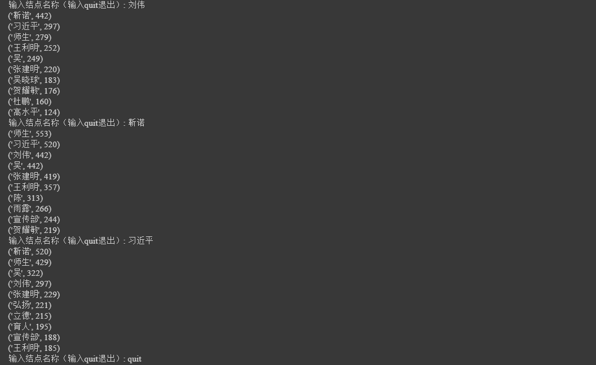

[TOC]


### 用户手册

---

#### 1. 函数接口说明

##### read_file(file_name)

> 进行数据预处理工作，读入csv文件并将文件转为json格式保存到本地

##### read_json(json_file_name)

> 读入json文件并返回该json文件对应的dict数据结构

##### closest_neighbour(er, k)

> 输入一个实体联系dict数据和结点名称，输出排名前k紧密的该结点的邻居

##### create_graph(er)

> 输入实体联系数据，由此生成一个networkx的无向图并作为返回值

##### graph_stat(G)

> 输入networkx中的无向图，输出图的基本数据，包括结点数、边数、连通分量数和最大连通分量


#### 2. 使用说明

##### 参数设置

首先设置各项参数，包括读入文件名、存储的json文件名

```python
file_name = "ruc_news.txt"
output_file = "er.json"
json_file_name = "er.json"
```


##### 生成数据

程序将首先对数据进行处理，将其转换为json格式后保存，同时生成在程序中将使用道德dict数据类型和network中的无向图。

```python
er = read_json(json_file_name)
G = create_graph(er)
```


##### 图的验证

调用`closest_neighbour`函数得到前十个联系最紧密的邻居：

```python
closest_neighbour(er, 10)
```

- 样例结果如下：

  

  

##### 图的统计

调用`graph_stat`得到图的基本数据

```
graph_stat(G)
```

- 样例结果如下：

  


##### 自选分析1：影响力计算

```python
# 任务一：Pagerank算法得出排名前20的结点
page_rank=nx.pagerank(G,alpha=0.85)
sorted_pr = sorted(page_rank.items(), key=lambda item:item[1])
print(sorted_pr[:20])
```


##### 自选分析2：中心性计算

```python
betweenness = nx.betweenness_centrality(G)
betweenness = sorted(betweenness.items(), key=lambda item:item[1], reverse = True)
print(betweenness[:10])
```


##### 自选分析3：结点聚集系数

```python
clustering_factor = nx.clustering(G)
sorted_clustering_factor = sorted(clustering_factor.items(), key=lambda item:item[1], reverse=True)
print(sorted_clustering_factor[:20])
```

